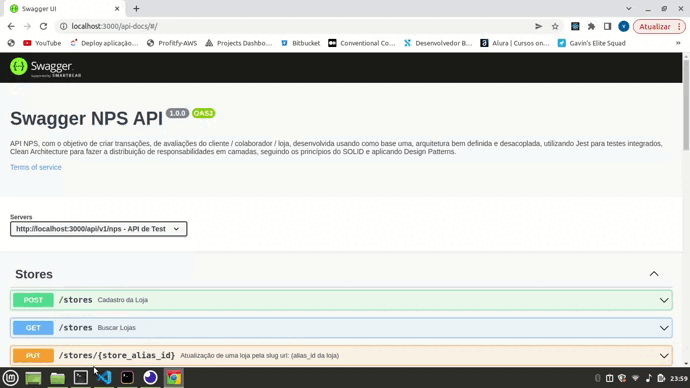
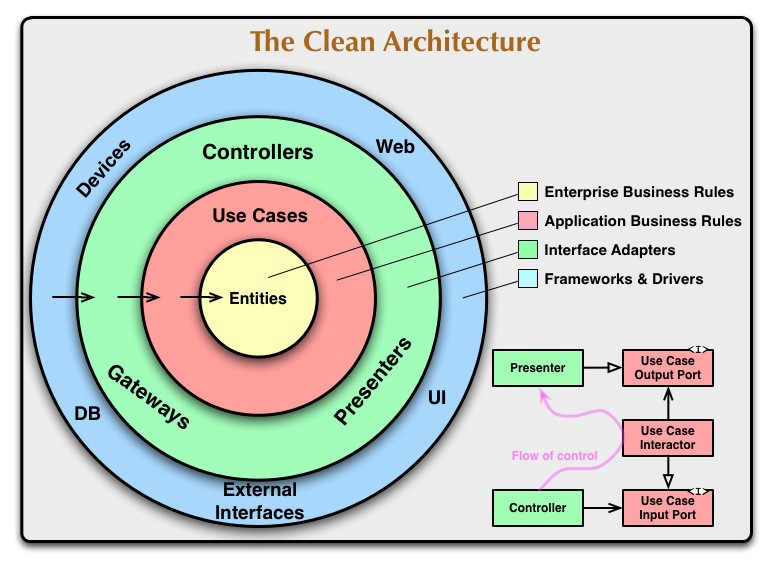
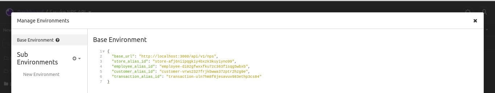
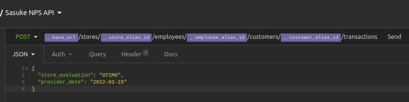
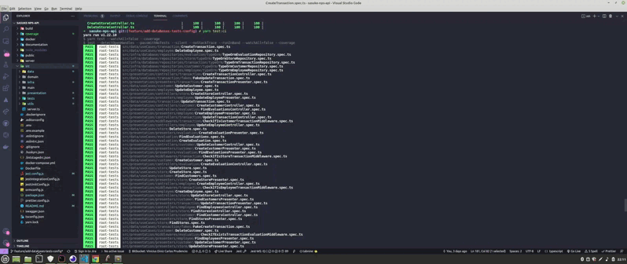
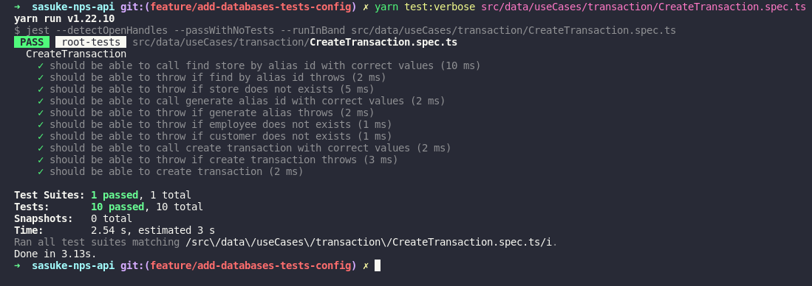

### NPS Application (API)
 

  

  

  

  

## Description

> API para aplicação NPS, com o objetivo de criar transações de avaliações do cliente/colaborador/loja, desenvolvida usando como base uma arquitetura bem definida e desacoplada, utilizando Jest para testes integrados, Clean Architecture para fazer a distribuição de responsabilidades em camadas, seguindo os princípios do SOLID e aplicando Design Patterns.
 

### Instalação dos pacotes :wrench:

> yarn install

### Rodar a aplicação :fast_forward:

> docker-compose up

## Verificar documentação da API (OpenAPI):

> http://localhost:3000/api-docs
 

> 

  

> ### Diagrama de modelagem do banco de dados :page_facing_up:
>
> 

 

> ## Arquitetura da API:
> 

 

> ### Verifique o slug url da entidade para atualização, remoção/desativação:

> 

 

> ### Exemplo da URL de transação:

> 

 

> ## testes

- ###### Para executar todos os testes: yarn test:ci

> 

 

- ###### Para executar somente um teste: yarn test:verbose caminho_do_arquivo

> 

> ## Princípios :books:

- Single Responsibility
- Open Closed
- Liskov Substitution
- Dependency Inversion
- Don't Repeat Yourself
- You Aren't Gonna Need It
- Keep It Simple
- Small Commits

> ## Design Patterns :triangular_ruler:

- Factory
- Adapter
- Decorator
- Command
- Dependency Injection
- Singleton
- Proxy
- Middlewares

> ## Metodologias e Designs :pencil2:

- Clean Architecture
- Use Cases

> ## Bibliotecas e Ferramentas :wrench:

- Yarn
- Typescript
- Swagger
- Git
- Jest
- TypeORM
- UUID
- Postgres
- Husky
- Lint Staged
- Eslint
- DotEnv
- Joi
- Faker
- Rand-Token

> ## Features do Typescript :computer:

- POO Avançado
- Interface
- Modularização de Paths
- Configurações

> ## Features de Testes :mag_right:

- Testes de Integração
- Cobertura de Testes
- Fakes
